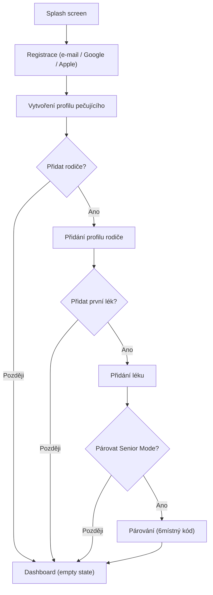
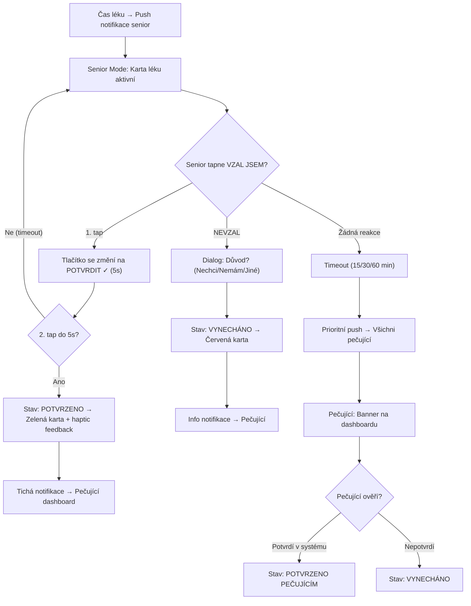
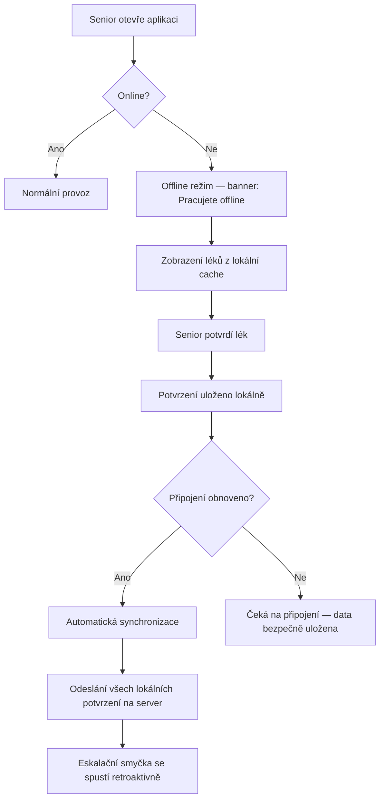

# Rodiče v péči (Fáze 2) — Finální UI/UX Design (po oponentní revizi)

> **Verze:** v1.0 (PAB — po oponentní revizi)
> **Datum:** 2026-04-01
> **Fáze procesu:** Oponent / Red Team (PAB)
> **Vstupy:**
> - Zákaznické zadání: `1_zadani/Rodice_v_peci_dokumentace_f2_komplet.md`
> - PA dokument: `2_outArchitekt/PA_Rodice_v_peci_F2_v1.md`
> - PAD dokument: `3_outUIUX/PAD_Rodice_v_peci_F2_v1.md`
> **Platforma:** PWA (mobile-first, responzivní)

---

## Změnový log (oponentní revize)

| # | Oblast | Typ změny | Popis |
|---|--------|-----------|-------|
| R1 | Senior Mode potvrzení | Úprava | Timeout dvoustupňového tapu prodloužen z 2s na 5s |
| R2 | Lékové karty | Úprava | Swipe gesto nahrazeno explicitním tlačítkem „Potvrdit za rodiče" |
| R3 | Tichý režim | Doplnění | Konfigurovatelnost per lék (noční léky mohou eskalovat i v noci) |
| R4 | Senior Mode offline | Doplnění | Plně offline provoz s lokálním potvrzením a sync po reconnect |
| R5 | Dashboard multi-profil | Doplnění | Přepínač profilů rodičů v headeru |
| R6 | Smart Test | Doplnění | Ukládání progressu rozpracovaného testu |
| R7 | Haptic feedback | Doplnění | Vibrace při potvrzení léku (chybělo z Design Systému) |
| R8 | Pull-to-refresh | Doplnění | Ruční sync kalendáře a notifikací tažením dolů |
| R9 | Swipe notifikace | Doplnění | Swipe doprava → akce (chybělo z Design Systému) |
| R10 | Offline chat | Doplnění | Offline stav + fronta zpráv + chybový stav |
| R11 | Compliance legenda | Doplnění | Legenda barev pod mřížkou |
| R12 | Chat audit trail | Doplnění | Info banner o permanenci zpráv |
| R13 | Párování expirace | Doplnění | Chybový stav pro expirovaný kód |
| R14 | Chat failed stav | Doplnění | Stav „zpráva neodeslána" + retry |
| R15 | Structural close review | Doplnění | Invarianty, failure scenárie, boundary awareness |

---

## Obsah

1. [Architektura a User Flow](#1-architektura-a-user-flow)
2. [Navigační struktura](#2-navigační-struktura)
3. [Onboarding & registrace](#3-onboarding--registrace)
4. [Dashboard](#4-dashboard)
5. [Lékový asistent](#5-lékový-asistent)
6. [Senior Mode](#6-senior-mode)
7. [Kalendář](#7-kalendář)
8. [Nárokový navigátor (Průvodce)](#8-nárokový-navigátor-průvodce)
9. [Rodinná komunikace (Chat & Notifikace)](#9-rodinná-komunikace-chat--notifikace)
10. [Nastavení](#10-nastavení)
11. [Mrazák (Soft Paywall)](#11-mrazák-soft-paywall)
12. [Globální stavy a vzory](#12-globální-stavy-a-vzory)
13. [Design tokeny (shrnutí)](#13-design-tokeny-shrnutí)
14. [Invarianty a systémové principy](#14-invarianty-a-systémové-principy)
15. [Failure scenárie](#15-failure-scenárie)
16. [Boundary Awareness](#16-boundary-awareness)

---

## 1. Architektura a User Flow

### 1.1 Hlavní navigační flow aplikace

Diagram zobrazuje primární navigační strukturu aplikace z pohledu pečujícího (Koordinátorky). Bottom tab bar je persistentní na všech hlavních obrazovkách. Chat a notifikace jsou dostupné z headeru na každé obrazovce.

```mermaid
flowchart TD
    subgraph NAV["Bottom Tab Bar"]
        DASH["Dashboard"]
        LEKY["Léky"]
        KAL["Kalendář"]
        PRUV["Průvodce"]
        NAST["Nastavení"]
    end

    subgraph HEADER["Header (persistent)"]
        PROFIL_SWITCH["Přepínač profilu rodiče"]
        CHAT_ICON["Chat inbox"]
        NOTIF_ICON["Notifikační centrum"]
    end

    DASH --> DASH_DETAIL["Denní přehled léků (karta)"]
    DASH --> KAL_WIDGET["Widget termínů"]
    DASH --> CHAT_FEED["Chat Quick-Feed"]

    LEKY --> LEK_SEZNAM["Seznam léků"]
    LEKY --> LEK_DETAIL["Detail léku"]
    LEKY --> LEK_PRIDANI["Přidat lék"]
    LEKY --> COMPLIANCE["Compliance mřížka"]

    KAL --> KAL_MESIC["Měsíční pohled"]
    KAL --> KAL_DEN["Denní detail"]
    KAL --> KAL_SYNC["Správa sync"]

    PRUV --> TEST["Smart Test nároků"]
    PRUV --> MAPA["Mapa nároků"]
    PRUV --> PRUVODCE_DETAIL["Detail průvodce"]

    NAST --> PROFIL["Profil rodiče"]
    NAST --> SENIOR_MGR["Správa Senior Mode"]
    NAST --> KONEKTIVITA["Propojené služby"]
    NAST --> UCET["Účet a předplatné"]

    CHAT_ICON --> CHAT_INBOX["Chat inbox (všechny konverzace)"]
    CHAT_INBOX --> CHAT_VLAKNO["Chatové vlákno (kontext)"]
    NOTIF_ICON --> NOTIF_CENTRUM["Notifikační centrum"]
```

[Zdroj: PA Kapitola 2 — Moduly systému, PA Kapitola 4 — Tok odpovědnosti]

*Změna R5: Přidán přepínač profilu rodiče do headeru.*

### 1.2 Onboarding flow

Onboarding je nelineární — uživatel může přeskočit libovolný krok a vrátit se k němu z Dashboardu. Systém zobrazuje progress a CTA pro nedokončené kroky.

[Zdroj: PA Kapitola 5 — KPI č. 4 (Onboarding completion)]

### 1.3 Eskalační smyčka léků — UI pohled

Diagram zobrazuje eskalační workflow z pohledu uživatelského rozhraní — co vidí senior a co vidí pečující v jednotlivých stavech. ~~Timeout 2 sekundy.~~ *Timeout 5 sekund pro dvoustupňové potvrzení (R1).*

[Zdroj: PA Kapitola 2 — Stavový model léků, PA Kapitola 4 — Diagram 4.1]

### 1.4 Senior Mode — Offline flow

*Nový diagram (R4). Zobrazuje chování Senior Mode při výpadku připojení. Léky se zobrazují z lokální cache, potvrzení se ukládají lokálně a synchronizují po obnovení připojení.*

[Zdroj: PA Kapitola 6 — Technické riziko FCM, Oponentní dotaz B1]

---

## 2. Navigační struktura

### Primární navigace (Bottom Tab Bar)

| Pozice | Ikona | Label | Cíl |
|--------|-------|-------|-----|
| 1 | Domek | Dashboard | Hlavní přehled |
| 2 | Pilulka | Léky | Lékový asistent |
| 3 | Kalendář | Kalendář | Rodinný kalendář |
| 4 | Kompas | Průvodce | Nárokový navigátor |
| 5 | Ozubené kolo | Nastavení | Nastavení účtu |

**Stav aktivní položky:** Vyplněná ikona + label tučně + barva primární (#1A73E8).
**Stav neaktivní:** Obrysová ikona + label regular + barva šedá (#757575).
**Badge:** Červený kruh (18×18 px) s bílým číslem na ikoně Léky (počet nepotvrzených léků dnes).

### Header (persistent)

| Pozice | Prvek | Popis |
|--------|-------|-------|
| Vlevo | *Přepínač profilu rodiče (R5)* | *Avatar rodiče (28px) + jméno. Tap = dropdown s dalšími profily. Pokud 1 profil, zobrazí pouze jméno bez přepínače.* |
| Střed | Název aktuální sekce | Text, 18px, Semi Bold |
| Vpravo | Chat ikona | Bublina + badge (počet nepřečtených zpráv) |
| Vpravo | Notifikace ikona | Zvonek + badge (počet nepřečtených notifikací) |

**Badge barvy:** Červená (#E53935) pro urgentní (eskalace léků), modrá (#1A73E8) pro běžné.

[Zdroj: PA Kapitola 2 — Moduly systému]

---

## 3. Onboarding & registrace

### Obrazovka: Splash screen

**Účel:** Branding + loading.
**Rozložení:**
- Logo aplikace (centrováno)
- Název „Rodiče v péči" pod logem
- Loading indikátor (subtle spinner)
- Doba zobrazení: max. 2 sekundy

### Obrazovka: Registrace

[Zdroj: PA Kapitola 1 — Primární aktér]

**Účel:** Vytvoření účtu. Dvě varianty přihlášení — sociální login i e-mail.

**Rozložení a komponenty:**
- **Nadpis:** „Vytvořte si účet" (24px, Bold)
- **Podnadpis:** „Začněte organizovat péči o své blízké" (16px, Regular, šedá)
- **Sociální login tlačítka (primární — nahoře):**
  - [Pokračovat přes Google] — bílé tlačítko s Google logem, plná šířka
  - [Pokračovat přes Apple] — černé tlačítko s Apple logem, plná šířka
- **Oddělovač:** horizontální čára s textem „nebo"
- **E-mail formulář:**
  - Input: E-mail (type=email, placeholder „vas@email.cz")
  - Input: Heslo (type=password, min. 8 znaků, ikona oka pro zobrazení)
  - [Vytvořit účet] — primární tlačítko, plná šířka
- **Spodní odkaz:** „Už máte účet? Přihlásit se"
- **Právní text:** „Pokračováním souhlasíte s Podmínkami a Zásadami ochrany osobních údajů" (12px, šedá, odkazy podtržené)

**Stavy:**
- **Chyba e-mailu:** Červený rámeček + „Zadejte platný e-mail"
- **Chyba hesla:** Červený rámeček + „Heslo musí mít alespoň 8 znaků"
- **E-mail existuje:** „Tento e-mail je již registrován. Chcete se přihlásit?"
- **Loading:** Tlačítko disabled + spinner

### Obrazovka: Vytvoření profilu pečujícího

**Účel:** Základní identifikace uživatele.

**Rozložení a komponenty:**
- **Nadpis:** „O vás" (24px, Bold)
- **Avatar:** Kruhový placeholder (80×80 px) s ikonou fotoaparátu, tap = výběr fotky
- **Input: Jméno** (povinné)
- **Input: Příjmení** (povinné)
- **Input: Telefon** (volitelné, pro budoucí notifikace)
- **[Pokračovat]** — primární tlačítko

### Obrazovka: Přidání profilu rodiče

[Zdroj: PA Kapitola 1 — Sekundární aktéři (senior)]

**Účel:** Vytvoření profilu osoby, o kterou se pečuje.

**Rozložení a komponenty:**
- **Nadpis:** „Koho opatrujete?" (24px, Bold)
- **Podnadpis:** „Vytvořte profil svého blízkého" (16px, Regular, šedá)
- **Input: Jméno** (povinné)
- **Input: Příjmení** (povinné)
- **Input: Datum narození** (volitelné, date picker)
- **Input: Vztah** (select: Matka / Otec / Babička / Dědeček / Jiné)
- **[Pokračovat]** — primární tlačítko
- **[Přeskočit]** — textový odkaz pod tlačítkem

**Empty state (pokud přeskočí):** Dashboard zobrazí kartu „Přidejte svého blízkého" s CTA.

---

## 4. Dashboard

### Obrazovka: Dashboard (hlavní)

[Zdroj: PA Kapitola 2 — Moduly systému, PA Kapitola 4 — Tok odpovědnosti]

**Účel:** Centrální přehled nejdůležitějších informací — léky dnes, nadcházející termíny, poslední chat aktivita. Scroll vertikálně, karty pod sebou.

*Změna R5: Pokud má uživatel více profilů rodičů, Dashboard zobrazuje data pro aktuálně vybraný profil (přepínač v headeru). Při přepnutí se obsah všech karet překreslí.*

**Rozložení a komponenty:**

#### Karta 1: Dnešní léky (P0)
- **Nadpis karty:** „Dnešní léky" + ikona pilulky (fialová #7B1FA2)
- **Obsah:** Seznam léků s časy a stavy:
  - Každý řádek: `[Čas] [Název léku] [Stav ikona]`
  - Stav ikona: ✓ zelená (potvrzeno) | ⚠ červená (eskalováno) | ○ šedá (čeká) | ✕ červená (vynecháno)
- **Levý svislý pruh:** 4px, fialová (#7B1FA2)
- **Akce:** Tap na řádek → detail léku. Tap na kartu → sekce Léky.
- **Eskalační banner (podmíněný):** Pokud existuje eskalovaný lék:
  - Červené pozadí (#FFEBEE), ikona ⚠, text „[Jméno rodiče] nepotvrdil/a [lék]. Zavolejte."
  - Tlačítko [Potvrdit za rodiče] + tlačítko [Zavolat] (tel: odkaz)
  - ~~Swipe doprava na kartě → rychlé potvrzení za pečujícího~~ *Nahrazeno explicitním tlačítkem [Potvrdit za rodiče] přímo na kartě (R2)*

#### Karta 2: Nadcházející termíny (P1)
- **Nadpis karty:** „Dnes a zítra" + ikona kalendáře (modrá)
- **Obsah:** Max. 3 nejbližší události:
  - Každý řádek: `[Čas] [Název události] [Barevná tečka]`
  - Barevné tečky: fialová = léky, modrá = péče, šedá = osobní (sync)
- **Akce:** Tap → detail události v Kalendáři
- **Empty state:** „Žádné termíny na dnes ani zítra."

#### Karta 3: Chat Quick-Feed (P1)
- **Nadpis karty:** „Rodinná komunikace" + ikona bubliny (teal #00796B)
- **Obsah:** Poslední 2 zprávy z rodinných vláken:
  - `[Avatar 28px] [Jméno]: [Zkrácený text zprávy] [Čas]`
- **Akce:** Tap na zprávu → chatové vlákno. Tap na nadpis → Chat inbox.
- **Empty state:** „Zatím žádné konverzace. Začněte diskuzi u libovolného léku, úkolu nebo dokumentu."

#### Karta 4: Compliance mini-přehled (P0)
- **Nadpis karty:** „Tento týden" + ikona grafu
- **Obsah:** Compliance mřížka 7 dní (Po–Ne), aktuální týden:
  - Buňky 32×32 px: zelená (#43A047) / červená (#E53935) / šedá (#9E9E9E)
  - Pod mřížkou: „Compliance: 85 %" (text)
  - *Legenda pod mřížkou (R11): „🟢 Vše podáno · 🔴 Vynechán lék · ⚫ Budoucí"*
- **Akce:** Tap → plný compliance pohled v sekci Léky

### Obrazovka: Dashboard (empty state — nový uživatel)

**Účel:** Průvodce prvním krokem pro uživatele bez profilu rodiče.

**Rozložení:**
- **Ilustrace:** Jednoduchá grafika rodiny (centrovaná)
- **Nadpis:** „Vítejte v Rodiče v péči" (24px, Bold)
- **Podnadpis:** „Začněte třemi jednoduchými kroky:" (16px, Regular)
- **Checklist:**
  - ☐ Přidejte profil svého blízkého → [Přidat rodiče]
  - ☐ Zadejte první lék → (neaktivní, čeká na profil)
  - ☐ Spárujte Senior Mode → (neaktivní, čeká na lék)
- **Progress bar:** 0/3 kroky dokončeny

**Stavy checklistu:** Dokončený krok = ✓ zelená + přeškrtnutý text. Aktuální krok = zvýrazněný + CTA tlačítko. Budoucí krok = šedý + neaktivní.

---

## 5. Lékový asistent

### Obrazovka: Seznam léků

[Zdroj: PA Kapitola 2 — Modul 1 (Lékový asistent), PA Kapitola 3 — P0]

**Účel:** Přehled všech léků v lékovém plánu rodiče s denním stavem.

**Rozložení a komponenty:**

- **Segment control (nahoře):** [Dnes] | [Lékový plán] | [Compliance]
  - **Dnes** = denní přehled s checkboxy (default)
  - **Lékový plán** = seznam všech léků bez denních stavů
  - **Compliance** = týdenní/měsíční mřížka
- ***Pull-to-refresh (R8):* Tažení dolů na libovolném tabu vynutí synchronizaci dat se serverem.*

#### Tab „Dnes"

- **Seskupení podle času:** Ráno (7:00) / Poledne (12:00) / Večer (19:00) / Noc (22:00)
- **Léková karta (pro každý lék):**
  - Levý pruh: 4px, fialová (#7B1FA2)
  - Obsah: Název léku (16px Bold) + Dávkování (14px Regular, šedá) + Poznámka (12px Italic, šedá, např. „Brát s jídlem")
  - Pravá strana: Stavový indikátor
    - ○ Čeká (šedý kroužek) + *tlačítko [Potvrdit za rodiče] (R2)*
    - ✓ Potvrzeno (zelený checkbox, pozadí #E8F5E9)
    - ⚠ Eskalováno (červený vykřičník, pozadí #FFEBEE) + *tlačítko [Potvrdit za rodiče] (R2)*
    - ✕ Vynecháno (červený křížek, pozadí #FFEBEE)
    - 👤 Potvrzeno pečujícím (zelený checkbox + ikona osoby)
- **Akce na kartě:** Tap na kartu → detail léku. ~~Swipe doprava → rychlé potvrzení za pečujícího~~ *Nahrazeno explicitním tlačítkem [Potvrdit za rodiče] na kartě se stavem Čeká nebo Eskalováno (R2). Tap na tlačítko → potvrzovací dialog „Potvrzujete, že [jméno rodiče] vzal/a lék [název]?"*
- **FAB (Floating Action Button):** Pravý dolní roh, „+" ikona → Přidat lék

#### Tab „Lékový plán"

- **Seznam:** Všechny léky řazené abecedně
- **Každý řádek:** Název | Dávkování | Frekvence (1×/2×/3× denně) | Časy | *Ikona noční eskalace (R3)*
- **Akce:** Tap → detail léku (editace). Long press → kontextové menu (Upravit / Smazat / Chat)
- ***Indikátor noční eskalace (R3):* Ikona měsíce u léků s povolenou noční eskalací.*

#### Tab „Compliance"

- **Compliance mřížka:** Kalendářní pohled, řádky = týdny, sloupce = Po–Ne
  - Buňky 32×32 px: zelená / červená / šedá (budoucí)
  - Tap na buňku → denní detail (které léky OK / vynechány)
  - *Legenda (R11): „🟢 Vše podáno · 🔴 Vynechán lék · ⚫ Budoucí / žádná data"*
- **Souhrnný řádek:** „Tento měsíc: 87 % compliance" + trend šipka (↑↓)
- **Filtr:** Dropdown pro výběr konkrétního léku nebo „Všechny léky"

### Obrazovka: Přidat / Upravit lék

[Zdroj: PA Kapitola 2 — Invariant č. 1 (lékový plán nelze měnit bez potvrzení)]

**Účel:** Formulář pro manuální zadání nového léku.

**Rozložení a komponenty:**
- **Nadpis:** „Nový lék" / „Upravit lék" (24px, Bold)
- **Input: Název léku** (povinné, autocomplete z lokálního číselníku pokud dostupný)
- **Input: Dávkování** (povinné, text + select jednotka: mg / ml / kapky / kusy)
- **Select: Frekvence** (1× denně / 2× denně / 3× denně / Jiné)
- **Time pickers:** Dynamicky podle frekvence (1–4 time pickery)
- **Textarea: Poznámka** (volitelné, placeholder „Např. brát s jídlem, nedrťte tabletu")
- **Toggle: Aktivní připomínky** (default ON)
- ***Toggle: Noční eskalace (R3):** „Eskalovat i v tichém režimu" (default OFF). Tooltip: „Zapněte pro léky, které se berou v noci. Eskalace proběhne i v tichém režimu 22:00–7:00." Zobrazuje se pouze u léků s časem podání v rozmezí 22:00–7:00.*
- **[Uložit]** — primární tlačítko
- **[Zrušit]** — textový odkaz

**Validace:**
- Název prázdný → „Zadejte název léku"
- Dávkování prázdné → „Zadejte dávkování"
- Čas nezadaný → „Vyberte čas podání"

**Invariant:** Při editaci existujícího léku se změna projeví **od dalšího dne**. Zobrazit info banner: „Změny se projeví od zítřka. Dnešní plán zůstává beze změny."

[Zdroj: PA Kapitola 6 — Concurrency: Editace lékového plánu během aktivních připomínek]

### Obrazovka: Detail léku

**Účel:** Kompletní informace o léku + historie + kontextový chat.

**Rozložení a komponenty:**
- **Header:** Název léku (20px Bold) + [Upravit] ikona tužky
- **Sekce Info:**
  - Dávkování: „5 mg, 1× denně v 7:00"
  - Poznámka: „Brát s jídlem"
  - Stav dnes: [Stav badge]
  - *Noční eskalace: „Eskalace v tichém režimu: Zapnuto/Vypnuto" (R3)*
- **Sekce Compliance (mini):** Posledních 7 dní jako tečky (zelená/červená/šedá)
- **Sekce Chat** (kontextový):
  - Ikona bubliny + „Diskuze o tomto léku" + počet zpráv
  - Tap → otevře chatové vlákno vázané na tento lék
- **[Smazat lék]** — červený textový odkaz, dole, s potvrzovacím dialogem

---

## 6. Senior Mode

[Zdroj: PA Kapitola 2 — Modul 1 (Senior Mode), PA Kapitola 3 — P0, PA Kapitola 4 — Diagram 4.4]

### Designové principy Senior Mode

Senior Mode je **zjednodušený pohled** nad existujícími daty, nikoli samostatná aplikace. Zapíná se automaticky na spárovaném zařízení seniora.

- **Typografie:** Minimum 24px pro body text, 36px pro nadpisy, 48px pro akční tlačítka
- **Kontrast:** WCAG AAA (minimum 7:1)
- **Interakce:** Pouze tap (žádný swipe, long press, drag)
- **Navigace:** Žádný bottom bar, žádný header. Přepínání mezi „Léky" a „Úkoly" pomocí dvou obřích tabů nahoře.
- **Barvy:** Bílé pozadí, černý text, zelené/červené akční tlačítka
- ***Haptic feedback (R7):* Jemná vibrace (100ms) při úspěšném potvrzení léku na zařízeních s podporou Vibration API.*
- ***Offline provoz (R4):* Senior Mode funguje plně offline. Léky se zobrazují z lokální cache, potvrzení se ukládají lokálně a synchronizují po obnovení připojení.*

### Obrazovka: Senior Mode — Párování

**Účel:** Prvotní spárování zařízení seniora s profilem v systému.

**Rozložení:**
- **Nadpis:** „PROPOJENÍ SE SYSTÉMEM" (36px, Bold, centrováno)
- **Instrukce:** „Zadejte kód, který vám dal váš blízký:" (24px)
- **Input: 6místný kód** — 6 samostatných polí (56×64 px každé), velké číslice, numerická klávesnice
- **[PROPOJIT]** — zelené tlačítko, plná šířka, 64px výška, 36px text
- **Chybový stav:** „Nesprávný kód. Zkuste to znovu." (červeně, 24px)
- ***Chybový stav expirace (R13):* „Platnost kódu vypršela. Požádejte svého blízkého o nový kód." (červeně, 24px). Tlačítko se změní na [ZKUSIT ZNOVU].*
- ***Info text:* „Kód je platný 10 minut." (20px, šedá) — pod vstupním polem.*

### Obrazovka: Senior Mode — Dnešní léky

**Účel:** Denní přehled léků s potvrzovacím flow.

**Rozložení:**
- **Tab bar (nahoře):** [LÉKY] | [ÚKOLY] — dva obří taby (50% šířky každý, 64px výška, 28px text)
- **Nadpis:** „VAŠE LÉKY" (36px, Bold)
- **Podnadpis:** „Dnes, úterý 1. dubna" (24px, šedá)
- ***Offline banner (R4):* Pokud offline, zobrazit žlutý banner nahoře: „PRACUJETE BEZ INTERNETU — LÉKY SE ULOŽÍ" (24px, černý text na žlutém #FFF9C4). Banner zmizí po reconnect.*

**Léková karta Senior Mode:**
- **Rozměr:** Plná šířka, min. 120px výška
- **Obsah:** Název léku (28px Bold) + Dávkování (20px Regular)
- **Čas:** „7:00 — Ráno" (20px, levý horní roh)
- **Akční tlačítko (stav Čeká):**
  - [VZAL JSEM] — zelené pozadí (#43A047), bílý text, 48px font, plná šířka karty, 80px výška
  - Po prvním tapu: tlačítko se změní na [POTVRDIT ✓] (tmavší zelená #2E7D32, bílý text, pulzující animace), ~~2 sekundy~~ *5 sekund timeout (R1)*
  - Po druhém tapu (potvrzení): karta se změní na zelené pozadí (#E8F5E9) + velký ✓ + „PODÁNO" (28px) + *haptic feedback vibrace (R7)*
  - Po timeoutu bez 2. tapu: vrátí se na [VZAL JSEM]
- **Tlačítko „Nevzal":**
  - [TEĎ NE] — šedé pozadí (#9E9E9E), bílý text, 36px font, pod hlavním tlačítkem, 56px výška
  - Po tapu: dialog „PROČ?" s třemi tlačítky: [NECHCI] / [NEMÁM LÉK] / [JINÝ DŮVOD] (každé 56px výška)

**Stavy karty:**
- **Čeká:** Bílé pozadí, zelené tlačítko [VZAL JSEM]
- **Potvrzuji (mezistav):** Tmavší zelené tlačítko [POTVRDIT ✓], pulzující, *5s timeout (R1)*
- **Podáno:** Světle zelené pozadí (#E8F5E9), velký ✓, text „PODÁNO"
- **Vynecháno:** Světle červené pozadí (#FFEBEE), text „VYNECHÁNO" + důvod
- ***Offline potvrzeno (R4):* Světle zelené pozadí (#E8F5E9), velký ✓, text „PODÁNO" + malá ikona offline (šedá) — indikace, že potvrzení čeká na synchronizaci.*

### Obrazovka: Senior Mode — Dnešní úkoly

**Účel:** Jednoduchý seznam úkolů pro seniora (pouze čtení, bez editace).

**Rozložení:**
- **Tab bar:** [LÉKY] | [ÚKOLY] (ÚKOLY aktivní)
- **Nadpis:** „VAŠE ÚKOLY" (36px, Bold)
- **Seznam úkolů:** Každý řádek 80px výška, 24px text, checkbox 40×40 px
- **Empty state:** „DNES ŽÁDNÉ ÚKOLY" (28px, centrováno, šedá)

### Obrazovka: Senior Mode — Denní shrnutí (21:00)

**Účel:** Večerní přehled — co bylo podáno, co ne.

**Rozložení:**
- **Nadpis:** „DNEŠNÍ SHRNUTÍ" (36px, Bold)
- **Seznam:** Každý lék + stav (PODÁNO ✓ / VYNECHÁNO ✕)
- **Souhrnný text:** „Podáno 3 ze 4 léků" (28px)
- **[DOBROU NOC]** — modré tlačítko, plná šířka, 80px výška (zavře shrnutí)

---

## 7. Kalendář

[Zdroj: PA Kapitola 2 — Modul 2 (Rodinný kalendář), PA Kapitola 4 — Diagram 4.3]

### Obrazovka: Kalendář — Měsíční pohled

**Účel:** Přehled měsíce s barevnými tečkami indikujícími typy událostí. Jeden kalendář s vrstvami.

**Rozložení a komponenty:**
- **Header:** [◀ Měsíc ▶] navigace + [Dnes] tlačítko
- **Filtrové chipy (pod headerem):**
  - [🟣 Léky] [🔵 Péče] [⚫ Osobní] — toggle on/off pro každou vrstvu
  - Aktivní chip: plná barva + bílý text. Neaktivní: obrysový.
- **Kalendářní mřížka:**
  - Dny v měsíci, dnešní den zvýrazněn kruhem (primární barva)
  - Pod každým dnem: max. 3 barevné tečky (8px průměr)
    - Fialová (#7B1FA2) = léky / zdraví
    - Modrá (#1A73E8) = péče / termíny
    - Šedá (#9E9E9E) = synchronizované osobní události
  - Pokud více než 3 události: „+2" text místo dalších teček
- **Akce:** Tap na den → Denní detail
- ***Pull-to-refresh (R8):* Tažení dolů vynutí synchronizaci s Google Calendar.*

**Sync indikátor (v headeru):**
- Zelená tečka (8px) = sync aktivní a aktuální
- Rotující ikona = probíhá synchronizace
- Červená tečka = chyba sync, tap → detail chyby

### Obrazovka: Kalendář — Denní detail

**Účel:** Chronologický seznam všech událostí daného dne.

**Rozložení:**
- **Header:** Datum (20px Bold) + den v týdnu
- **Časová osa:** Vertikální seznam událostí řazených chronologicky
- **Událostní karta:**
  - Levý svislý pruh (4px): barva podle typu (fialová/modrá/šedá)
  - Čas (14px, šedá)
  - Název události (16px Bold)
  - Podnadpis: lokace / poznámka (14px, šedá)
  - Pro synchronizované události: ikona sync (🔄) + „z Google Calendar"
  - Pro události s chatem: ikona bubliny + počet zpráv
- **FAB:** „+" → Přidat událost

**Přepínač sdílení (u synchronizovaných osobních událostí):**
- Toggle „Sdílet s rodinou" [ANO/NE] přímo na kartě
- Při zapnutí: událost se propíše do rodinného kalendáře + push ostatním
- Smart tip (podmíněný): „Rozpoznali jsme návštěvu lékaře. Chcete ji sdílet s rodinou?" → [ANO] / [NE]

[Zdroj: PA Kapitola 2 — Invariant č. 3 (soukromí kalendáře)]

### Obrazovka: Správa synchronizace kalendáře

**Účel:** OAuth propojení a správa synchronizovaných kalendářů.

**Rozložení:**
- **Nadpis:** „Propojené kalendáře"
- **Google Calendar:**
  - Stav: [Propojeno ✓] / [Propojit]
  - Pokud propojeno: seznam kalendářů s toggle „Synchronizovat" pro každý
  - Tlačítko [Odpojit] (červený text)
- **Apple Calendar:** (F2 v1.1 — zobrazit jako neaktivní)
  - Šedý stav: „Brzy dostupné"
- **Info text:** „Synchronizace probíhá automaticky. Vy sami si zvolíte, které události sdílíte s rodinou."

**Mrazák trigger:** Pokud uživatel Free zkusí zapnout obousměrnou sync → mrazák screen.

---

## 8. Nárokový navigátor (Průvodce)

[Zdroj: PA Kapitola 2 — Modul 3 (Nárokový navigátor), PA Kapitola 3 — P1]

### Obrazovka: Průvodce — Hlavní rozcestník

**Účel:** Vstupní bod do sekce nároků. Dvě hlavní cesty: Smart Test a katalog průvodců.

**Rozložení:**
- **Hero karta (nahoře):** Smart Test nároků
  - Nadpis: „Zjistěte, na co máte nárok" (20px Bold)
  - Podnadpis: „Odpovězte na 8 otázek a dostanete osobní Mapu nároků" (14px)
  - [Spustit test] / *[Pokračovat v testu] — pokud existuje rozpracovaný test (R6)*
  - Ilustrace: jednoduchá grafika (ikona lupy + dokumenty)
  - *Progress indikátor (R6): Pokud rozpracovaný test: „Rozpracováno: 5/8 otázek" (14px, šedá)*
- **Katalog průvodců (pod hero kartou):**
  - Seznam karet (vertikálně):
    - Příspěvek na péči (PnP) — z F1
    - Průkaz ZTP/P — nový v F2
    - (Invalidní důchod — v MVP pokud čas dovolí)
    - (Mobilita, Pomůcky — F2 v1.1)
  - Každá karta: Ikona + Název + Krátký popis + [Otevřít]
  - Neaktivní průvodce: Šedé, „Připravujeme"

### Obrazovka: Smart Test nároků (wizard)

**Účel:** Interaktivní dotazník generující personalizovanou Mapu nároků.

**Rozložení:**
- **Progress bar:** Nahoře, horizontální, X/8 otázek
- **Otázka:** Velký text (20px Bold), centrovaný
- **Odpovědi:** 2–4 tlačítka (plná šířka, 56px výška každé)
  - Tap na odpověď → automaticky přejde na další otázku (s animací slide)
- **Navigace:** [← Zpět] textový odkaz vlevo dole
- ***Ukládání progressu (R6):* Progress se automaticky ukládá po každé odpovědi. Při opuštění testu a návratu se zobrazí dialog: „Chcete pokračovat v rozpracovaném testu, nebo začít znovu?" → [Pokračovat] / [Začít znovu]*
- **Příklad otázek:**
  1. „Jaký je věk vašeho blízkého?" → [65–74] [75–84] [85+]
  2. „Potřebuje pomoc při pohybu?" → [Ne] [Částečně] [Ano, výrazně]
  3. „Potřebuje pomoc při hygieně?" → [Ne] [Částečně] [Ano]
  - ...atd. (8–12 otázek)

### Obrazovka: Mapa nároků (výsledek)

**Účel:** Personalizovaný přehled nároků s odhadovanými částkami.

**Rozložení:**
- **Nadpis:** „Vaše Mapa nároků" (24px Bold)
- **Souhrnná karta (nahoře):**
  - „Váš blízký má pravděpodobně nárok na:" (16px)
  - Celková odhadovaná částka: „až 15 600 Kč / měsíc" (28px Bold, zelená)
- **Seznam nároků (karty):**
  - Každá karta:
    - Název nároku (16px Bold)
    - Odhadovaná částka (16px, zelená)
    - Pravděpodobnost: [Vysoká ✓] / [Střední ~] / [Nízká ?] (badge)
    - [Otevřít průvodce] — sekundární tlačítko
- **CTA (Premium upsell):**
  - „Chcete kompletní průvodce s vzory odvolání?" → [Zobrazit Premium]
  - V MVP: mrazák screen → proklik bez platby

**Disclaimer (dole):** „Částky jsou orientační odhady. Skutečný nárok závisí na individuálním posouzení." (12px, šedá)

### Obrazovka: Detail průvodce

**Účel:** Strukturovaný krokový návod pro konkrétní dávku.

**Rozložení:**
- **Header:** Název průvodce (20px Bold) + ikona chatu (kontextový chat k průvodci)
- **Obsah:** Strukturovaný text s checklistem kroků
- **Cross-linking:** „Související: Průkaz ZTP/P →" (odkaz na jiný průvodce)

---

## 9. Rodinná komunikace (Chat & Notifikace)

[Zdroj: PA Kapitola 2 — Modul 4 (Rodinná komunikace), PA Kapitola 2 — Invariant č. 4 (chat jako audit trail)]

### Obrazovka: Chat inbox (centrální přehled)

**Účel:** Seznam všech chatových vláken napříč kontexty. Přístupný z ikony chatu v headeru.

**Rozložení:**
- **Nadpis:** „Zprávy" (20px Bold)
- **Seznam vláken:** Řazeno chronologicky (poslední aktivita nahoře)
  - Každý řádek:
    - Ikona kontextu: 💊 (lék) / 📅 (událost) / 📄 (dokument) / 📋 (úkol)
    - Název kontextu: „Warfarin" / „Kontrola u kardiologa" / „Plná moc"
    - Poslední zpráva: „Petr: Zavolal jsem doktorce..." (zkráceno, 14px, šedá)
    - Čas poslední zprávy
    - Badge nepřečtených (červený kruh)
- **Empty state:** „Zatím žádné konverzace. Začněte diskuzi u libovolného léku, úkolu nebo dokumentu."

**Free omezení (indikátor):**
- Banner nahoře: „Vidíte zprávy za posledních 7 dní." + [Premium: Neomezená historie]
- V MVP: mrazák → proklik bez blokace

### Obrazovka: Chatové vlákno (kontextové)

**Účel:** Konverzace vázaná na konkrétní záznam (lék, událost, dokument).

**Rozložení:**
- **Header:** Ikona kontextu + Název záznamu + [Zobrazit detail] odkaz
- ***Info banner permanence (R12):* Při odeslání první zprávy ve vlákně: „Zprávy v tomto vlákně jsou trvalou součástí záznamu a nelze je smazat." (12px, šedé pozadí, dismiss tlačítko ×). Zobrazí se pouze jednou.*
- **Oblast zpráv:** Scroll, nejnovější dole
  - Vlastní zprávy: vpravo, zelené pozadí (#E0F2F1), max. 75% šířky
  - Cizí zprávy: vlevo, šedé pozadí (#F5F5F5), avatar 28px kulatý
  - @zmínka: zvýrazněná modře (#1A73E8), tap → profil zmíněného
  - Časové oddělovače: „Dnes", „Včera", „15. března" (centrovaný text, šedý)
  - ***Zpráva neodeslána (R14):* Červený vykřičník ⚠ vedle bubliny + text „Neodeslána" (červeně, 12px). Tap → [Zkusit znovu] / [Smazat].*
  - ***Offline stav (R10):* Zprávy napsané offline se zobrazí s šedou bublinou a ikonou hodin ⏳. Po reconnect se automaticky odešlou a změní barvu na normální.*
- **Input bar (dole):**
  - Textové pole (placeholder „Napište zprávu...")
  - Ikona @ pro zmínku (otevře picker členů rodiny)
  - [Odeslat] tlačítko (ikona šipky)
  - ***Offline (R10):* Input bar zůstává aktivní. Zprávy se řadí do lokální fronty.*
- **Systémové zprávy:** Šedý text, centrovaný, bez bubliny
  - Např. „Lék Warfarin byl upraven Janou" (audit trail)

**Přístup ke kontextovému chatu:** Ikona bubliny (💬) v detailu léku, události, dokumentu nebo úkolu. Zobrazuje počet zpráv.

[Zdroj: PA Kapitola 2 — Invariant č. 4 (zprávy nelze mazat)]

### Obrazovka: Notifikační centrum

**Účel:** Sjednocený seznam všech systémových a rodinných notifikací.

**Rozložení:**
- **Nadpis:** „Upozornění" (20px Bold)
- **Filtrové chipy:** [Vše] [🟣 Léky] [🔵 Kalendář] [🟢 Rodina] [⚫ Systém]
- ***Pull-to-refresh (R8):* Tažení dolů obnoví seznam notifikací.*
- **Seznam notifikací:** Chronologicky, nejnovější nahoře
  - Každá notifikace:
    - Barevný levý pruh (4px): fialová / modrá / zelená / šedá
    - Ikona typu
    - Text notifikace (16px)
    - Čas (14px, šedá)
    - Nepřečtená: tučný text + modrá tečka
  - **Akce na notifikaci:** Tap → navigace na relevantní obrazovku. Swipe doleva → archivovat. *Swipe doprava → primární akce (R9): např. u eskalace léku = „Potvrdit za rodiče", u chat zmínky = „Otevřít vlákno".*
- **Empty state:** „Žádná nová upozornění."

**Tichý režim:** Notifikace se neposílají 22:00–7:00 (konfigurovatelné v Nastavení). *Výjimka (R3): Léky s povolenou noční eskalací generují push notifikace i v tichém režimu.* V notifikačním centru se ostatní notifikace zobrazí po probuzení.

[Zdroj: PA Kapitola 6 — Behaviorální rizika (Notification fatigue)]

---

## 10. Nastavení

[Zdroj: PA Kapitola 2 — Modul 5, PA Kapitola 4 — Bottlenecky]

### Obrazovka: Nastavení — Hlavní

**Účel:** Správa účtu, profilů, propojení a preferencí.

**Rozložení (seznam sekcí):**

#### Sekce: Profily rodičů
- Seznam profilů (max. 2 v MVP): [Jméno + avatar] → tap = editace profilu
- [+ Přidat profil rodiče] (pokud < 2)

#### Sekce: Senior Mode
- Seznam spárovaných zařízení: „Maminčin tablet — spárováno 15.3.2026"
- [Vygenerovat nový kód] → zobrazí 6místný kód (platnost 10 minut) + *odpočet zbývajícího času*
- Nastavení eskalací:
  - „Eskalovat po:" [15 min ▼] / [30 min ▼] / [60 min ▼] (select, default 30)
  - „Zklidnit eskalace po:" [3 ignorovaných ▼] (toggle + select)

#### Sekce: Propojené služby
- Google Calendar: [Propojeno ✓] / [Propojit] → navigace na správu sync
- Apple Calendar: „Brzy dostupné" (šedé)

#### Sekce: Notifikace
- Toggle: „Tichý režim (22:00–7:00)" (default ON)
- Time pickery pro úpravu tichého okna
- *Info text (R3): „Léky s noční eskalací budou připomínat i v tichém režimu. Toto nastavení je u jednotlivých léků."*
- Toggle: „Léky — urgentní notifikace" (default ON, nelze vypnout — invariant č. 2)
- Toggle: „Kalendář — připomenutí termínů" (default ON)
- Toggle: „Rodina — nové zprávy" (default ON)
- Toggle: „Systém — aktualizace průvodců" (default ON)

**Invariant č. 2 vizualizace:** Toggle „Léky — urgentní notifikace" je vždy ON, šedý (disabled) s tooltip: „Eskalace léků nelze vypnout z bezpečnostních důvodů."

#### Sekce: Rodinný tým
- Seznam členů rodiny s rolemi: „Jana (Admin)" / „Petr (Člen)"
- [Pozvat člena] → generuje pozvánkový odkaz
- Role: Admin (plná správa) / Člen (čtení + chat)

#### Sekce: Účet
- E-mail, změna hesla
- [Předplatné] → detail Premium / Free + mrazák
- [Exportovat data] → stažení ZIP (F2 v1.1 — zatím neaktivní, „Připravujeme")
- [Odhlásit se]
- [Smazat účet] — červený text, potvrzovací dialog s heslem

---

## 11. Mrazák (Soft Paywall)

[Zdroj: PA Kapitola 3 — Paywall v MVP]

### Obrazovka: Mrazák screen

**Účel:** Zobrazení Premium nabídky před prvním použitím placené funkce. V MVP se zobrazí, ale neblokuje.

**Trigger:** První pokus o použití Premium funkce (obousměrný kalendář, plná Mapa nároků, neomezená chat historie).

**Timing:** Nikdy se nezobrazí před dokončením onboardingu a prvním úspěšným use-case.

**Rozložení:**
- **Overlay:** Poloprůhledné pozadí (dimming 60%)
- **Karta (centrovaná, 90% šířky):**
  - **Nadpis:** „Odemkněte plný potenciál" (24px Bold)
  - **Seznam výhod:**
    - ✓ Obousměrná synchronizace kalendářů
    - ✓ Kompletní Mapa nároků s vzory odvolání
    - ✓ Neomezená historie rodinného chatu
    - ✓ Měsíční PDF reporty pro lékaře
  - **Cena:** „199 Kč / měsíc" (28px Bold)
  - **[Zkusit Premium]** — primární tlačítko (v MVP: proklikne bez platby + zobrazí toast „Premium aktivováno v testovacím režimu")
  - **[Teď ne]** — textový odkaz (zavře mrazák, funkce zůstane dostupná)
- **Disclaimer:** „V testovacím období jsou všechny funkce zdarma." (12px, šedá) — pouze v MVP

---

## 12. Globální stavy a vzory

### Empty states

| Obrazovka | Empty state text | CTA |
|---|---|---|
| Dashboard (nový uživatel) | „Vítejte! Začněte přidáním svého blízkého." | [Přidat rodiče] |
| Seznam léků | „Zatím žádné léky. Přidejte první lék." | [Přidat lék] |
| Kalendář (bez sync) | „Propojte kalendář pro lepší přehled." | [Propojit Google] |
| Chat inbox | „Zatím žádné konverzace." | — |
| Notifikace | „Žádná nová upozornění." | — |
| Compliance mřížka | „Přidejte léky pro sledování compliance." | [Přidat lék] |
| Mapa nároků | „Spusťte test a zjistěte své nároky." | [Spustit test] |
| *Smart Test (rozpracovaný) (R6)* | *„Máte rozpracovaný test (5/8)."* | *[Pokračovat] / [Začít znovu]* |

### Chybové stavy

| Situace | Zobrazení | Akce |
|---|---|---|
| Výpadek připojení | Banner nahoře: „Jste offline. Data se synchronizují po obnovení." (žlutý) | Auto-dismiss po reconnect |
| *Senior Mode offline (R4)* | *Banner: „PRACUJETE BEZ INTERNETU — LÉKY SE ULOŽÍ" (žlutý, 24px)* | *Auto-dismiss po reconnect + sync* |
| Chyba sync kalendáře | Červená tečka u sync indikátoru + notifikace | Tap → detail chyby + [Zkusit znovu] |
| Push nedoručen (FCM) | In-app banner při otevření: „Máte nepotvrzené léky" | Zobrazit seznam čekajících léků |
| Chyba serveru | Fullscreen: „Něco se pokazilo. Zkuste to za chvíli." | [Zkusit znovu] |
| Neplatný OAuth token | Banner: „Propojení s Google Calendar vypršelo." | [Znovu propojit] |
| *Zpráva neodeslána (R14)* | *Červený ⚠ vedle bubliny + „Neodeslána"* | *Tap → [Zkusit znovu] / [Smazat]* |
| *Párování — expirovaný kód (R13)* | *„Platnost kódu vypršela. Požádejte o nový."* | *[ZKUSIT ZNOVU]* |

### Loading stavy

| Situace | Zobrazení |
|---|---|
| Načítání obrazovky | Skeleton screen (šedé placeholder pruhy animované shimmer efektem) |
| Odesílání zprávy | Bublina se šedým pozadím + spinner, po odeslání = normální barva |
| *Offline fronta zpráv (R10)* | *Bublina s ikonou hodin ⏳, po sync = normální barva* |
| Sync kalendáře | Rotující ikona u sync indikátoru |
| Ukládání léku | Tlačítko disabled + spinner |

### Potvrzovací dialogy

| Akce | Dialog text | Tlačítka |
|---|---|---|
| Smazání léku | „Opravdu chcete smazat lék [název]? Tato akce je nevratná." | [Smazat] červené / [Zrušit] |
| Potvrzení léku za seniora | „Potvrzujete, že [jméno rodiče] vzal/a lék [název]?" | [Potvrdit] zelené / [Zrušit] |
| Odpojení kalendáře | „Odpojit Google Calendar? Synchronizované události zůstanou v aplikaci." | [Odpojit] / [Zrušit] |
| Smazání účtu | „Tato akce smaže váš účet a všechna data. Zadejte heslo pro potvrzení." | Input heslo + [Smazat účet] červené / [Zrušit] |

### Interakční vzory

| Vzor | Popis |
|---|---|
| *Haptic feedback (R7)* | *Jemná vibrace (100ms) při potvrzení léku v Senior Mode i běžném režimu. Pouze na zařízeních s Vibration API.* |
| *Pull-to-refresh (R8)* | *Tažení dolů na obrazovkách: Seznam léků, Kalendář, Notifikační centrum. Vynutí synchronizaci dat se serverem.* |
| *Swipe notifikace (R9)* | *Swipe doleva → archivovat. Swipe doprava → primární akce (kontextová: potvrdit lék / otevřít chat / zobrazit detail).* |

---

## 13. Design tokeny (shrnutí)

### Barvy

| Název | HEX | Použití |
|---|---|---|
| Primární modrá | #1A73E8 | Navigace, odkazy, aktivní prvky |
| Léky fialová | #7B1FA2 | Lékový asistent, připomínky, compliance |
| Chat teal | #00796B | Chat bubliny, ikony rodiny |
| Compliance zelená | #43A047 | Podáno, úspěch, potvrzení |
| Compliance červená | #E53935 | Vynecháno, eskalace, chyba |
| Externí šedá | #9E9E9E | Sync události, neaktivní prvky, systémové notifikace |
| Pozadí zelená | #E8F5E9 | Pozadí potvrzené lékové karty |
| Pozadí červená | #FFEBEE | Pozadí vynechané/eskalované lékové karty |
| Pozadí chat vlastní | #E0F2F1 | Vlastní chat bubliny |
| Pozadí chat cizí | #F5F5F5 | Cizí chat bubliny |
| *Offline žlutá (R4)* | *#FFF9C4* | *Offline bannery (Senior Mode i běžný režim)* |
| Text primární | #212121 | Hlavní text |
| Text sekundární | #757575 | Podnadpisy, placeholdery, metadata |

### Typografie

| Úroveň | Velikost | Váha | Použití |
|---|---|---|---|
| H1 | 24px | Bold | Nadpisy obrazovek |
| H2 | 20px | Bold | Nadpisy sekcí, karet |
| Body | 16px | Regular | Hlavní text, názvy léků |
| Caption | 14px | Regular | Metadata, časy, podnadpisy |
| Small | 12px | Regular | Disclaimery, právní text |
| Senior H1 | 36px | Bold | Senior Mode nadpisy |
| Senior Body | 24px | Regular | Senior Mode text |
| Senior Button | 48px | Bold | Senior Mode akční tlačítka |

### Rozměry komponent

| Komponenta | Rozměr |
|---|---|
| Bottom tab bar | 56px výška |
| Header | 56px výška |
| Primární tlačítko | 48px výška, plná šířka, border-radius 8px |
| Léková karta | min. 72px výška, plná šířka, levý pruh 4px |
| Senior Mode tlačítko | 80px výška, plná šířka |
| Chat bublina | max. 75% šířky, padding 12px, border-radius 16px |
| Avatar (chat) | 28×28 px, kulatý |
| Badge | 18×18 px, kulatý, červený |
| Compliance buňka | 32×32 px |
| Sync tečka | 8×8 px |
| Notifikační badge | 18×18 px |

### Spacing

| Token | Hodnota | Použití |
|---|---|---|
| xs | 4px | Vnitřní padding malých prvků |
| sm | 8px | Mezery mezi ikonami, badge offset |
| md | 16px | Padding karet, mezery mezi sekcemi |
| lg | 24px | Margin mezi kartami na dashboardu |
| xl | 32px | Horní/dolní margin obrazovek |

---

## 14. Invarianty a systémové principy

*Nová kapitola přidaná oponentní revizí. Konsoliduje invarianty z PA dokumentu a doplňuje je o UI implikace.*

| # | Invariant | UI implikace |
|---|-----------|--------------|
| 1 | **Lékový plán nelze měnit bez potvrzení uživatele** | OCR import (F2 v1.1) vždy zobrazí návrh + potvrzovací dialog. Nikdy automatický zápis. |
| 2 | **Eskalace nelze vypnout** | Toggle v Nastavení je disabled (šedý, vždy ON) s tooltip vysvětlením. |
| 3 | **Soukromí kalendáře** | Každá událost má explicitní opt-in toggle „Sdílet s rodinou". Default = NE. |
| 4 | **Chat je audit trail** | Zprávy nelze mazat. Info banner při první zprávě. Anonymizace při smazání účtu. |
| 5 | **Data export vždy dostupný** | Tlačítko v Nastavení (v MVP neaktivní, F2 v1.1). |
| 6 | *Změny lékového plánu platí od dalšího dne (R3 z PA)* | *Info banner při editaci léku. Dnešní plán je zamčený po prvním připomenutí.* |
| 7 | *Noční eskalace je konfigurovatelná per lék (R3)* | *Toggle „Noční eskalace" na formuláři léku. Default OFF.* |

---

## 15. Failure scenárie

*Nová kapitola přidaná oponentní revizí. Definuje chování systému při selhání klíčových komponent.*

| Scénář | Chování systému | UI indikace |
|--------|----------------|-------------|
| **FCM selhání (push nedoručen)** | Systém přejde do degradovaného režimu. Při dalším otevření aplikace zobrazí in-app banner s nepotvzenými léky. | Žlutý banner „Máte nepotvrzené léky" + seznam |
| **Google Calendar API nedostupné** | Sync se zastaví, lokální data zůstanou beze změny. Retry automaticky po 15 min. | Červená tečka u sync indikátoru + notifikace „Synchronizace selhala" |
| **OAuth token expiroval** | Sync se zastaví, uživatel je vyzván k opětovné autorizaci. | Banner „Propojení vypršelo" + [Znovu propojit] |
| **Server nedostupný (výpadek)** | Aplikace zobrazí cached data. Senior Mode funguje offline (R4). Chat zprávy se řadí do fronty (R10). | Žlutý offline banner + lokální provoz |
| **Částečný výpadek (jen chat)** | Ostatní moduly fungují normálně. Chat zobrazí chybu. | Zprávy ve frontě s ikonou ⏳, po obnovení auto-sync |
| **Senior Mode — zařízení bez internetu delší dobu** | Lokální potvrzení se kumulují. Po reconnect se odešlou hromadně. Eskalační smyčka se spustí retroaktivně na serveru (pečující dostanou souhrnnou notifikaci). | Offline indikátor na kartách + souhrnná notifikace pečujícím |

---

## 16. Boundary Awareness

*Nová kapitola přidaná oponentní revizí. Odpovídá na otázky z checklistu, které jsou relevantní pro produktovou architekturu.*

### Výkonnost a škálování
Systém je navržen pro desítky tisíc uživatelů (B2C), ale MVP validuje s 50 rodinami. Špičky: ranní a večerní lékové připomínky (7:00, 19:00) generují burst push notifikací. Výkonnostní architektura je řešena v technické fázi.

### Bezpečnost a přístupová práva
Systém pracuje s citlivými zdravotními daty (lékový plán, compliance). Existují role s odlišnými právy (Admin vs. Člen vs. Senior). Auditovatelnost je vyžadována (invariant č. 4 — chat jako audit trail). Bezpečnostní model je navazující vrstva implementace.

### Integrace třetích stran
Systém závisí na Google Calendar OAuth a Firebase Cloud Messaging. Obě služby mohou selhat — failure scenárie jsou definovány v kapitole 15. Žádná integrace nemá právní váhu. Integrace představuje technickou závislost mimo kontrolu systému.

### Concurrency
Dva pečující mohou potvrdit stejný lék současně (řešeno optimistic locking — první vyhrává). Senior může potvrdit lék ve chvíli eskalace (řešeno 5s oknem). Kritické rozhodovací body vyžadují atomické zpracování.

### Datová kvalita
Léková data vznikají manuálně (MVP) nebo přes OCR (F2 v1.1). OCR data jsou vždy neověřená — povinné potvrzení uživatelem (invariant č. 1). Systém rozlišuje mezi ověřenými a neověřenými daty.

### Právní a regulatorní rámec
Lékový asistent NENÍ zdravotnický prostředek — pouze připomíná uživatelem zadaný plán, neposkytuje zdravotní rady. Disclaimery jsou součástí onboardingu. Chat jako audit trail vyžaduje posouzení GDPR (právo na výmaz vs. trvalost zpráv — řešeno anonymizací). Regulatorní požadavky jsou zohledněny v navazující fázi.

### Provozní odpovědnost
V MVP fázi je vlastníkem systému zadavatel/produktový vlastník. Single founder risk identifikován v PA dokumentu — self-contained dokumentace umožňuje přenos. Provozní model je definován mimo tento dokument.

### Životní cyklus a budoucí změny
Systém je navržen jako rozšiřitelný (F2 v1.0 → v1.1 → F3). Verzovací logika je definována. Riziko scope creep je mitigováno kapitolou 3 PA dokumentu (explicitní vyloučení). Systém je navržen jako rozšiřitelný bez narušení základních invariantů.

---

**Stav procesu: DOKUMENT JE FINÁLNÍ.**

> Proces GetDesign je tímto dokončen. Výstupní dokumenty:
> - `2_outArchitekt/PA_Rodice_v_peci_F2_v1.md` — Product Architecture Document
> - `3_outUIUX/PAD_Rodice_v_peci_F2_v1.md` — UI/UX Design Document
> - `4_outOponent/PAB_Rodice_v_peci_F2_v1.md` — Finální dokument po oponentní revizi
